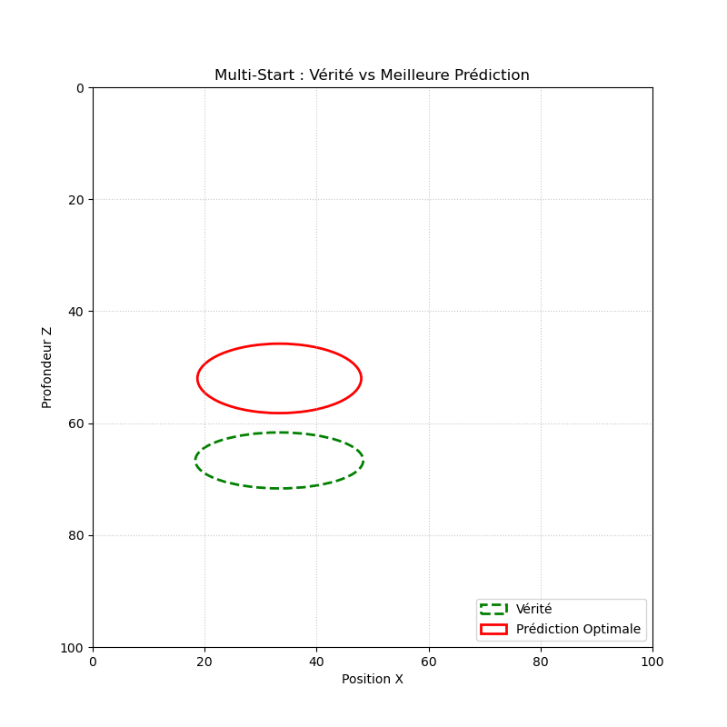
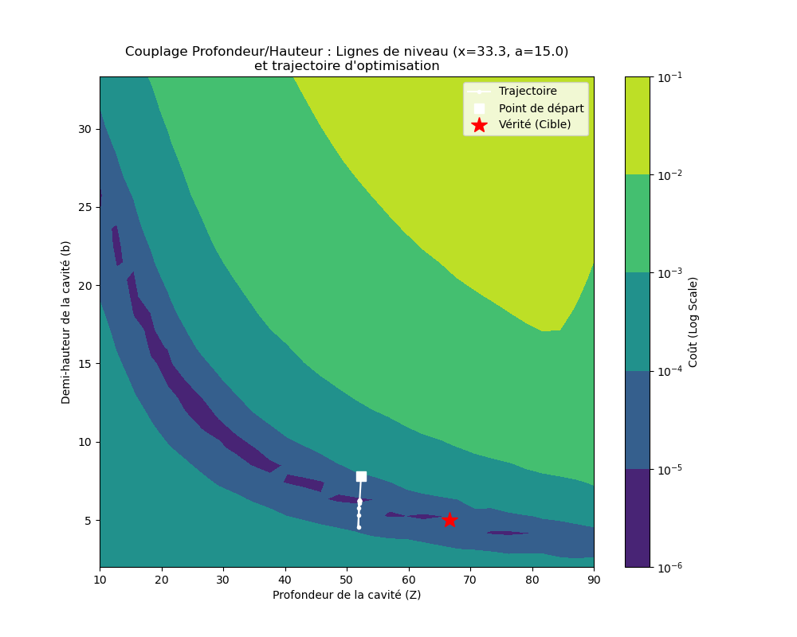

# Underground Cavity Detection via Non-Linear Optimization


## Project Overview
This repository contains a Python implementation of an inverse geophysical problem solver. The goal is to estimate the parameters of an underground elliptical cavity (lateral position, depth, width, and height) based solely on vertical surface displacement measurements (e.g., radar interferometry data).

**Academic Context:** This work was originally initiated as part of the **L3 SAPHIRE** Optimization course (Prof. Kieffer) at **ENS Paris-Saclay**. It was subsequently resumed, heavily refactored, and mathematically expanded in light of the advanced concepts studied in the **M1 Mathematics and Applications** Optimization course (Prof. E. Trélat) at **Sorbonne Université**.

## Physics & Forward Model
The subsurface is modeled as a 2D semi-infinite linear elastic medium on a 100x100m grid. Neglecting Poisson's ratio effects for computational efficiency, the static mechanical equilibrium relates vertical strain $\epsilon_z$ to displacement $U_z$ through the integration of the fundamental statics equation:
$$E\frac{\partial \epsilon_z}{\partial z} + \rho g = 0$$

The forward model computes the displacement field from the bottom boundary to the free surface. The implementation features **heavy matrix vectorization** (NumPy) along the horizontal axis, cutting computation time drastically and enabling stochastic multi-evaluation algorithms.

## Inverse Problem & Optimization Algorithm
The goal is to minimize the $L^2$-norm of the difference between measured surface displacements and computed surface displacements:
$$Cost(x_c, z_c, a, b) = || U_z^{\text{computed}} - U_z^{\text{measured}} ||^2$$

### From Gauss-Newton to Non-Linear Conjugate Gradient
The initial Gauss-Newton implementation suffered from severe oscillations and local minima entrapment due to the ill-conditioned nature of the problem. To overcome this, the solver was upgraded to a **Non-Linear Conjugate Gradient** method:
1. **Polak-Ribière Formula:** The conjugate direction is updated using the $\beta_k^{PR}$ parameter (with an automatic restart condition $\beta_k = \max(0, \beta_k^{PR})$) to retain inertia and navigate narrow valleys efficiently.
2. **Exact Hessian Step Size (Cauchy Step):** The optimal descent step $\rho_k$ is calculated dynamically using the local Hessian matrix computed via central finite differences.
3. **Multi-Start Strategy:** To bypass local minima, the algorithm is wrapped in a stochastic Multi-Start loop with physically constrained random initial guesses, retaining the absolute global minimum across all runs.

## Key Findings: Topological Analysis & Ill-Posedness
By computing the 3D contour maps of the cost function, this project highlights the fundamental limits of geophysical inversion based solely on vertical displacement:

* **Strong Identifiability (Position & Width):** The algorithm pinpoints the lateral position ($x_c$) and width ($a$) with near-perfect accuracy, as the cost function gradient is extremely steep along these axes.
* **The "Equivalence Valley" (Depth vs. Height):** The optimization landscape reveals a degenerate, diagonal valley between depth ($z_c$) and height ($b$). A deeper but taller cavity generates an almost identical surface subsidence to a shallower, thinner one. The algorithm quickly reaches the bottom of this valley but stagnates due to a near-zero gradient ($< 10^{-12}$). This demonstrates the mathematically **ill-posed** nature of the problem.
* **Discrete Locking:** The rigid Eulerian grid ($1 \times 1$ m) creates sub-pixel error plateaus, preventing standard gradient methods from finding continuous decimal optima.

## Visual Results

### Target vs. Prediction

> The algorithm successfully locates the cavity's horizontal center and width, demonstrating the robustness of the Multi-Start Conjugate Gradient approach.

### Cost Function Landscape & Equivalence Valley

> Contour map showing the trajectory of the algorithm sliding into the "equivalence valley" before stagnating due to the ill-posed physics of depth vs. height.

## How to Run
```bash
git clone [https://github.com/your-username/cavity-detection-optimization.git](https://github.com/your-username/cavity-detection-optimization.git)
cd cavity-detection-optimization
pip install -r requirements.txt
python main.py
